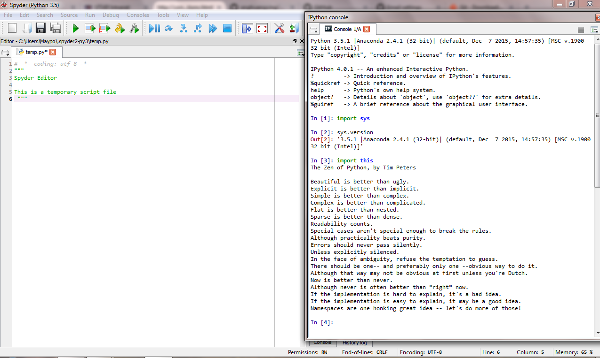

UECM3033 Assignment #1 Report
========================================================

- Prepared by: ** Ang Huang Ying**
- Tutorial Group: T2

--------------------------------------------------------

## Task 1 -- setup a github repository

The reports, codes and supporting documents are uploaded to Github at: 

[https://github.com/your_github_anghuangying/UECM3033_assign1](https://github.com/your_github_anghuangying/UECM3033_assign1)

---------------------------------------------------------

## Task 2 -- setup python

Put here the screen shot of file (python.png)

------------------------------------------------------------

## Task 3 -- modify and run Python script

In this section, please report:

    1.The hexadecimal value of your student ID.
    Hexadecimal representation of 1307589 is 0x13f3c5

    2.Write down the definite integrals that you have chosen.
$$\int_{\pi/3}^{\pi/6} {2xcos}{(3x+\pi)} dx= - \frac {\pi}{9}-\frac{2}{9}$$
    
    3.Write down your system of 10 linear equations.
    
 \begin{align}  x_1+2x_2+3x_3+4x_4+5x_5+6x_6+7x_7+8x_8+9x_9+10x_{10}&= 405. \\
2x_1+3x_2+4x_3+5x_4+6x_5+7x_6+8x_7+9x_8+11x_{10} &= 395.\\
3x_1+4x_2+5x_3+6x_4+7x_5+8x_6+9x_7+10x_8+11x_9+12x_{10} &= 545. \\
4x_1+5x_2+6x_3+7x_4+8x_5+9x_6+11x_8+12x_9+13x_{10} &= 555. \\
5x_1+6x_2+7x_3+8x_4+9x_5+10x_6+11x_7+12x_8+13x_9+14x_{10} &= 685. \\
6x_1+7x_2+8x_3+9x_4+11x_6+12x_7+13x_8+14x_9+15x_{10}&= 665. \\
7x_1+8x_2+9x_3+10x_4+11x_5+12x_6+13x_7+14x_8+15x_9+16x_{10} &= 825. \\
8x_1+9x_2+11x_4+12x_5+13x_6+14x_7+15x_8+16x_9+17x_{10} &= 825. \\
9x_1+10x_2+11x_3+12x_4+13x_5+14x_6+15x_7+16x_8+17x_9+18x_{10} &= 965. \\
11x_2+12x_3+13x_4+14x_5+15x_6+16x_7+17x_8+18x_9+19x_{10} &= 985. \end{align}

Solution : \begin{align} x_1 = 5,\ x_2= 77.82825,\ x_3 = 7,\ x_4 = -238.75,\ x_5 = 9,\ x_6 = 582.1875,\ x_7 = 6,\ x_8 = -694.4375,\ x_9 = 8,\ x_{10 }= 308.171875\end{align}

Here are the examples of how to add equations in markdown:

$$\int_0^{\infty} e^{-x^2} dx = \frac{\sqrt{\pi}}{2}.$$

\begin{align} 3 x_0 +x_1 &= 9,\ x_0 + 2 x_1 &= 8. \end{align}

-----------------------------------

last modified: 28 Jan 2016
